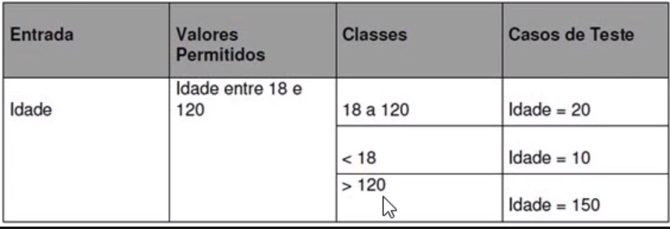

# Anotações

## Patterns for writing good tests:
Arrange, act, assert - https://automationpanda.com/2020/07/07/arrange-act-assert-a-pattern-for-writing-good-tests/
Give, when, then - https://medium.com/@matheus.saraujo/testes-give-when-then-3bf3fef55f5e

## Muitos testes na aplicação?
Preciso escrever um teste pra cada detalhe da aplicação? Não. 
Pra evitar isso, podemos usar algumas técnicas como: 

### Técnica de classes de equivalência
Basta apenas pegar os cenários que podem ser testados em apenas um teste, e juntá-los. Por exemplo:


### Análise de valor de limite/fronteira
Nesse cenário, testamos sempre o valor mais próximmo do valor limite:


Ver mais em: http://testwarequality.blogspot.com/p/tenicas-de-teste.html

### Data provider

Um Data Provider no PHPUnit é uma função que fornece conjuntos de dados para serem usados como entrada em testes unitários. Ele permite que você execute o mesmo teste com diferentes dados de entrada, ajudando a garantir a robustez e a abrangência dos testes. O PHPUnit chama a função do Data Provider e passa os dados para a função de teste, permitindo a execução do teste com múltiplas combinações de entrada. Isso é especialmente útil para testar diferentes cenários e casos de borda em suas classes e métodos.

```
/**
* @dataProvider leilaoEmOrdemAleatoria
* @dataProvider leilaoEmOrdemCrescente
* @dataProvider leilaoEmOrdemDecrescente
*/
```

### Fixtures
Para executar código antes ou depois de testes, o PHPUnit nos fornece as fixtures. São métodos que vão ser executados em momentos específicos.

Método executado uma vez só, antes de todos os testes da classe:
```
public static function setUpBeforeClass(): void
```

Método executado antes de cada teste da classe
```
public function setUp(): void
```

Método executado após cada teste da classe:
```
public function tearDown(): void
```

Método executado uma vez só, após todos os testes da classe
```
public static function tearDownAfterClass(): void
```

Para ter mais detalhes e ver alguns exemplos práticos, você pode conferir a [documentação](https://docs.phpunit.de/en/8.5/fixtures.html)
 desta feature do PHPUnit.